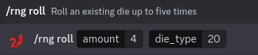
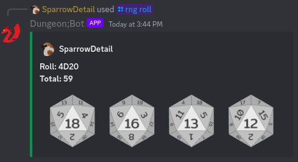

# DungeonBot
A discord bot geared towards providing DnD utilities to a discord server

## Requirements
- [discord.py](https://discordpy.readthedocs.io/en/stable/intro.html) - designed using discord.py version 2.3.2
- [Pillow(Fork)](https://pillow.readthedocs.io/en/stable/installation.html) - used in roll image generation, designed using version 10.3.0

### Recommended
Pillow(Fork) recommends running within a [virtual environment(venv)](https://docs.python.org/3/library/venv.html)

# Cogs
All user commands utilize the discord.py app_command structure to register the bot commands as 'slashcommands.' Below is a sample use of the
`rng` command group `roll` command:

## RNG
Random number generation commands.

### `/rng roll`
Allows the user to roll up to four dice from an accepted list of available die assets (D2, D4, D6, D8, D10, D12, and D20)

### `/rng random`
Generates 1 to 10 random values with a specified head size. The head must be a positive integer greater than 0. For example, a head of 100
will generate a random value from 1 to 100.

## Initiative
Provides commands that allow users to create and manage initiative order tables. These are generated per-user based on their unique discord user
id.

### `/initiative private`
Sends a direct message (DM) to the user to allow the user to execute commands privately. Recommended for when several initiative rolls need to be added to
the table.

### `/initiative show`
Generate and display an embed containing the users initiative rolls

### `/initiative add` and `/initiative add_show`
Commands used to add characters to the initiative order. Requires the user to enter a character name (string) and a roll modifier (integer). The `add`
command will simply add the data to the table, while the `add_show` command will add the data and generate a new embed to display to the users.

### `/initiative insert`
Functions similarly to `/initiative add`, but allows the user to enter a custom roll value. This was implemented for those that wish to roll realworld
dice over computer generated random values.

### `/initiative remove` and `/initiative remove_show`
Commands used to remove characters from the initiative order. Requires the user to enter a character name (string) that they wish to remove. The `remove`
command will simply remove the data from the table, while the `remove_show` command will remove the data and generate a new embed to display to the users.

### `/initiative clear`
Removes all initiative roll entries for the user
