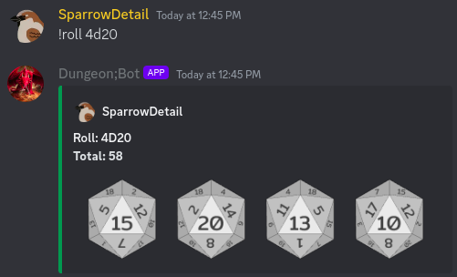

# DungeonBot
A discord bot geared towards providing DnD utilities to a discord server

## Requirements
- [discord.py](https://discordpy.readthedocs.io/en/stable/intro.html) - designed using discord.py version 2.3.2
- [Pillow(Fork)](https://pillow.readthedocs.io/en/stable/installation.html) - used in roll image generation

### Recommended
Pillow(Fork) recommends running within a [virtual environment(venv)](https://docs.python.org/3/library/venv.html)

## Cogs
All commands currently utilize a "!" prefix, but the project is slated to move towards 'slashcommands'

### Roll
Generate a set of rolls from a traditional DnD die (D2, D4, D6, D8, D10, D12, D20). Currently, you can only roll up to four dice.
All arguments must be in the form 'XdY', where 'X' is the number of die you wish to roll and 'Y' is the type of die you wish to roll, example:

